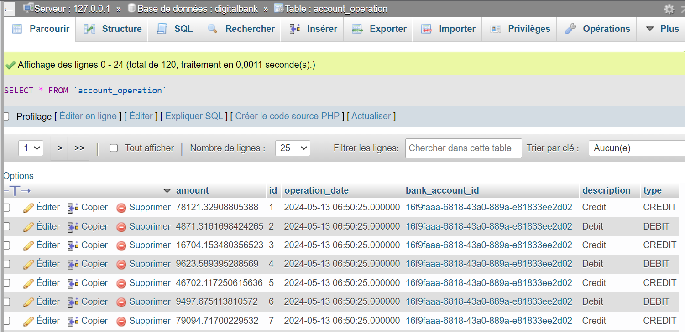

<h2> Jpa, Hibernate Spring Data  </h2>
# Projet de Gestion de Patients
<h4>Réaliser par Maryam Nfad </h4>
Le projet de Digital Banking vise à développer une application complète de gestion de comptes bancaires, offrant aux utilisateurs une plateforme pour gérer leurs transactions financières.

## fonctionnalités du projet :

1. Gestion des Clients : Permet aux utilisateurs de saisir, ajouter, supprimer et éditer des informations sur les clients.

2. Gestion des Comptes : Offre aux utilisateurs la possibilité de créer différents types de comptes, tels que les comptes courants et les comptes épargnes, et de gérer leurs opérations financières associées.

3. Opérations Financières : Autorise les utilisateurs à effectuer des opérations telles que les transferts, les débits et les crédits sur leurs comptes.
## Structure  du projet :
**Backend** :

**Frontend** :

## Réalisation 
 **Base de données MySQL** :
    - Une fois le développement initial terminé, migrez la base de données de H2 vers MySQL en modifiant la configuration de l'unité de persistance et en ajustant les dépendances Maven si nécessaire.
      
      
      
      
- **Tester les opérations de gestion de patientde bank avec swagger ** :
      
- Generer  docs  avec  swagger 
-  

## Execution 

      
      
      
    
    
 
 